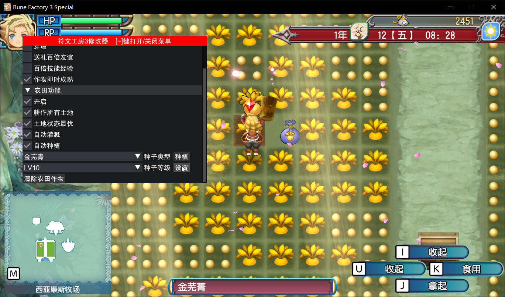

# Rune Factory 3 Trainer / 符文工房3修改器



## 下载

https://github.com/vSylva/rune_factory_3_trainer/releases

## 使用方式

将 **xinput1_4.dll** 放入游戏根目录中，启动游戏等待游戏窗口正常化后会自动显示UI

## 备注

如果刚进入游戏，**角色不能移动**，将游戏窗口最小化在打开就可以了

## 编译

安装 Visual Studio 2022 C++ 构建工具

安装 Rust 工具链

git clone https://github.com/vSylva/rune_factory_3_trainer.git

```rust
cargo +stable build --release
```

## Reference/引用

https://fearlessrevolution.com/viewtopic.php?t=25714
